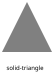
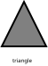
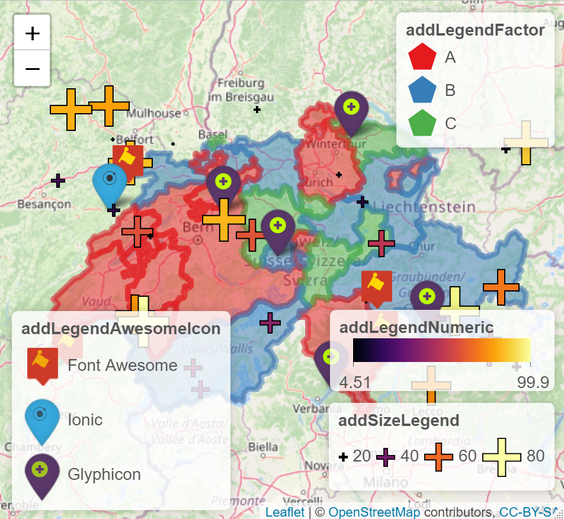

# leaflegend

This package provides extensions to the leaflet package to customize
leaflet legends without adding an outside css file to the output to
style legends. The legend extensions allow the user to add images to
legends, style the labels of the legend items, change orientation of the
legend items, use different symbologies, and style axis ticks. Syntax
and style is consistent with the leaflet package. Helper functions are
provided to create map symbols for plotting as well.

## Installation

You can install the released version of leaflegend from
[CRAN](https://CRAN.R-project.org) with:

\
[`install.packages`](https://rdrr.io/r/utils/install.packages.html)`(``"leaflegend"``)`

Install the development version with:

\
`devtools``::`[`install_github`](https://devtools.r-lib.org/reference/install-deprecated.html)`(``"tomroh/leaflegend"``)`

## Tutorials

- [Introduction to
  leaflegend](https://roh.engineering/posts/2021/02/introduction-to-leaflegend/)

- [Map Symbols and Size
  Legends](https://roh.engineering/posts/2021/05/map-symbols-and-size-legends-for-leaflet/)

- [Awesome Marker
  Legends](https://roh.engineering/posts/2021/10/awesome-marker-legends-in-leaflet/)

- [leaflegend
  Recipes](https://roh.engineering/posts/2022/07/leaflegend-recipes/)

## Map Symbols

**default**


**pch**



**special**


## Example

Use `addLegend*()` to create easily customizable legends for leaflet.

\
[`library`](https://rdrr.io/r/base/library.html)`(`[`leaflet`](https://rstudio.github.io/leaflet/)`)`\
[`library`](https://rdrr.io/r/base/library.html)`(`[`leaflegend`](https://leaflegend.delveds.com)`)`\
[`set.seed`](https://rdrr.io/r/base/Random.html)`(``21``)`\
[`data`](https://rdrr.io/r/utils/data.html)`(``"gadmCHE"``)`\
`gadmCHE``@``data``$``x`` ``<-`` `[`sample`](https://rdrr.io/r/base/sample.html)`(`[`c`](https://rdrr.io/r/base/c.html)`(``'A'``, ``'B'``, ``'C'``)``, `[`nrow`](https://rdrr.io/r/base/nrow.html)`(``gadmCHE``@``data``)``, replace ``=`` ``TRUE``)`\
`factorPal`` ``<-`` `[`colorFactor`](https://rstudio.github.io/leaflet/reference/colorNumeric.html)`(`[`c`](https://rdrr.io/r/base/c.html)`(``'#1f77b4'``, ``'#ff7f0e'`` , ``'#2ca02c'``)``, ``gadmCHE``@``data``$``x``)`\
`n`` ``<-`` ``10`\
`awesomeMarkers`` ``<-`` `[`data.frame`](https://rdrr.io/r/base/data.frame.html)`(`\
`  marker ``=`` `[`sample`](https://rdrr.io/r/base/sample.html)`(`[`c`](https://rdrr.io/r/base/c.html)`(``'Font Awesome'``, ``'Ionic'``, ``'Glyphicon'``)``, ``n``, replace ``=`` ``TRUE``)``,`\
`  lng ``=`` `[`runif`](https://rdrr.io/r/stats/Uniform.html)`(``n``, ``gadmCHE``@``bbox``[``1``,``1``]``, ``gadmCHE``@``bbox``[``1``,``2``]``)``,`\
`  lat ``=`` `[`runif`](https://rdrr.io/r/stats/Uniform.html)`(``n``, ``gadmCHE``@``bbox``[``2``,``1``]``, ``gadmCHE``@``bbox``[``2``,``2``]``)`\
`)`\
`n2`` ``<-`` ``30`\
`symbolMarkers`` ``<-`` `[`data.frame`](https://rdrr.io/r/base/data.frame.html)`(`\
`  x ``=`` `[`runif`](https://rdrr.io/r/stats/Uniform.html)`(``n2``, ``0``, ``100``)``,`\
`  y ``=`` `[`runif`](https://rdrr.io/r/stats/Uniform.html)`(``n2``, ``10``, ``30``)``,`\
`  lng ``=`` `[`runif`](https://rdrr.io/r/stats/Uniform.html)`(``n2``, ``gadmCHE``@``bbox``[``1``,``1``]``, ``gadmCHE``@``bbox``[``1``,``2``]``)``,`\
`  lat ``=`` `[`runif`](https://rdrr.io/r/stats/Uniform.html)`(``n2``, ``gadmCHE``@``bbox``[``2``,``1``]``, ``gadmCHE``@``bbox``[``2``,``2``]``)`\
`)`\
`numericPal`` ``<-`` `[`colorNumeric`](https://rstudio.github.io/leaflet/reference/colorNumeric.html)`(`[`hcl.colors`](https://rdrr.io/r/grDevices/palettes.html)`(``10``, palette ``=`` ``'zissou'``)``,`\
`                           ``symbolMarkers``$``y``)`\
`iconSet`` ``<-`` `[`awesomeIconList`](https://rstudio.github.io/leaflet/reference/awesomeIconList.html)`(`\
``   `Font Awesome`  ```=`` `[`makeAwesomeIcon`](https://rstudio.github.io/leaflet/reference/makeAwesomeIcon.html)`(``icon ``=`` ``"font-awesome"``, library ``=`` ``"fa"``,`\
`                                   iconColor ``=`` ``'rgb(192, 255, 0)'``,`\
`                                   markerColor ``=`` ``'lightgray'``,`\
`                                   squareMarker ``=`` ``TRUE``, iconRotate ``=`` ``30`\
`  ``)``,`\
`  Ionic ``=`` `[`makeAwesomeIcon`](https://rstudio.github.io/leaflet/reference/makeAwesomeIcon.html)`(``icon ``=`` ``"ionic"``, library ``=`` ``"ion"``,`\
`                          iconColor ``=`` ``'gold'``, markerColor ``=`` ``'gray'``,`\
`                          squareMarker ``=`` ``FALSE``)``,`\
`  Glyphicon ``=`` `[`makeAwesomeIcon`](https://rstudio.github.io/leaflet/reference/makeAwesomeIcon.html)`(``icon ``=`` ``"plus-sign"``, library ``=`` ``"glyphicon"``,`\
`                              iconColor ``=`` ``'#ffffff'``,`\
`                              markerColor ``=`` ``'black'``, squareMarker ``=`` ``FALSE``)`\
`)`\
[`leaflet`](https://rstudio.github.io/leaflet/reference/leaflet.html)`(``)`` ``|>`\
`  `[`addTiles`](https://rstudio.github.io/leaflet/reference/map-layers.html)`(``)`` ``|>`\
`  `[`addPolygons`](https://rstudio.github.io/leaflet/reference/map-layers.html)`(``data ``=`` ``gadmCHE``, color ``=`` ``~``factorPal``(``x``)``, fillOpacity ``=`` ``.5``,`\
`              opacity ``=`` ``0``, group ``=`` ``'Polygons'``)`` ``|>`\
`  `[`addLegendFactor`](https://leaflegend.delveds.com/reference/addLeafLegends.md)`(``pal ``=`` ``factorPal``, shape ``=`` ``'polygon'``, fillOpacity ``=`` ``.5``,`\
`                  opacity ``=`` ``0``, values ``=`` ``~``x``, title ``=`` ``'addLegendFactor'``,`\
`                  position ``=`` ``'topright'``, data ``=`` ``gadmCHE``, group ``=`` ``'Polygons'``)`` ``|>`\
`  `[`addAwesomeMarkers`](https://rstudio.github.io/leaflet/reference/addAwesomeMarkers.html)`(``data ``=`` ``awesomeMarkers``, lat ``=`` ``~``lat``, lng ``=`` ``~``lng``,`\
`                    icon ``=`` ``~``iconSet``[``marker``]``,`\
`                    group ``=`` ``'Awesome Icons'``)`` ``|>`\
`  `[`addLegendAwesomeIcon`](https://leaflegend.delveds.com/reference/addLegendAwesomeIcon.md)`(``iconSet ``=`` ``iconSet``, title ``=`` ``'addLegendAwesomeIcon'``,`\
`                       position ``=`` ``'bottomleft'``,`\
`                       group ``=`` ``'Awesome Icons'``)`` ``|>`\
`  `[`addSymbolsSize`](https://leaflegend.delveds.com/reference/mapSymbols.md)`(``data ``=`` ``symbolMarkers``, fillOpacity ``=`` ``.7``, shape ``=`` ``'plus'``,`\
`                 values ``=`` ``~``x``, lat ``=`` ``~``lat``, lng ``=`` ``~``lng``, baseSize ``=`` ``20``,`\
`                 fillColor ``=`` ``~``numericPal``(``y``)``, color ``=`` ``'black'``,`\
`                 group ``=`` ``'Symbols'``)`` ``|>`\
`  `[`addLegendSize`](https://leaflegend.delveds.com/reference/legendSymbols.md)`(``pal ``=`` ``numericPal``, shape ``=`` ``'plus'``, color ``=`` ``'black'``,`\
`                fillColor ``=`` ``'transparent'``, baseSize ``=`` ``20``, fillOpacity ``=`` ``.7``,`\
`                values ``=`` ``~``x``, orientation ``=`` ``'horizontal'``,`\
`                title ``=`` ``'addSizeLegend'``, position ``=`` ``'bottomright'``,`\
`                group ``=`` ``'Symbols'``, data ``=`` ``symbolMarkers``)`` ``|>`\
`  `[`addLegendNumeric`](https://leaflegend.delveds.com/reference/addLeafLegends.md)`(``pal ``=`` ``numericPal``, values ``=`` ``~``y``, title ``=`` ``'addLegendNumeric'``,`\
`                   orientation ``=`` ``'horizontal'``, fillOpacity ``=`` ``.7``, width ``=`` ``150``,`\
`                   height ``=`` ``20``, position ``=`` ``'bottomright'``, group ``=`` ``'Symbols'``,`\
`                   data ``=`` ``symbolMarkers``)`` ``|>`\
`  `[`addLayersControl`](https://rstudio.github.io/leaflet/reference/addLayersControl.html)`(``overlayGroups ``=`` `[`c`](https://rdrr.io/r/base/c.html)`(``'Polygons'``, ``'Awesome Icons'``, ``'Symbols'``)``,`\
`                   position ``=`` ``'topleft'``,`\
`                   options ``=`` `[`layersControlOptions`](https://rstudio.github.io/leaflet/reference/addLayersControl.html)`(``collapsed ``=`` ``FALSE``)``)`


